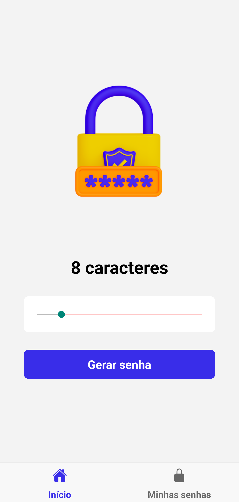
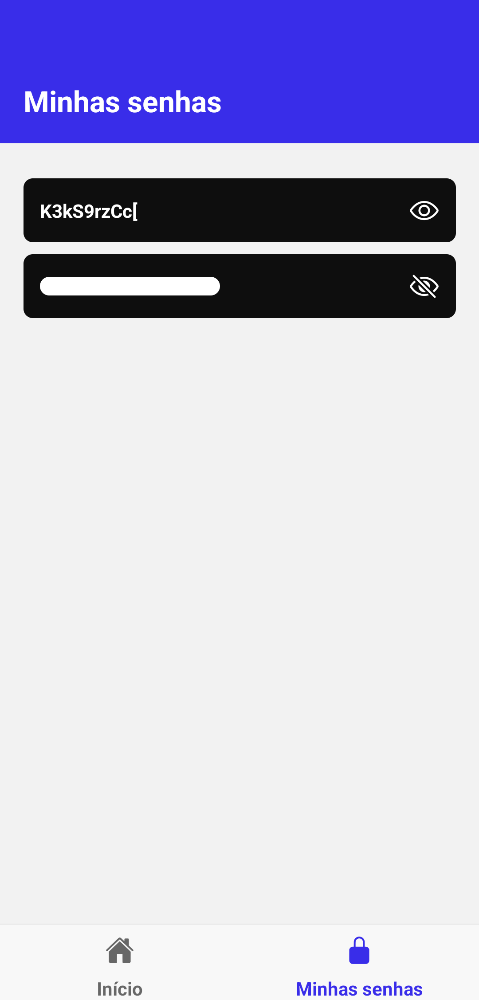

# 🔐 Password Generator

Um aplicativo de geração de senhas, feito com React Native e Expo.

## 📚 Tabela de Conteúdos

- [🔐 Password Generator](#-password-generator)
  - [📚 Tabela de Conteúdos](#-tabela-de-conteúdos)
  - [📋 Descrição](#-descrição)
    - [🚀 Funcionalidades](#-funcionalidades)
    - [🌐 Acesso](#-acesso)
    - [📸 Prévia](#-prévia)
  - [⚙️ Construção](#️-construção)
    - [💻 Tecnologias](#-tecnologias)
    - [🛠️ Ferramentas](#️-ferramentas)
    - [📌 Versão](#-versão)
  - [✏️ Aprendizado](#️-aprendizado)
  - [✒️ Autores](#️-autores)
  - [🎁 Agradecimentos](#-agradecimentos)
  - [📨 Contato](#-contato)

## 📋 Descrição

O Password Generator é um aplicativo mobile desenvolvido em React Native e Expo para gerar senhas seguras e personalizadas. Este projeto busca oferecer uma forma prática de criar senhas com diferentes quantidades de caracteres, armazenando-as localmente de maneira assíncrona.

### 🚀 Funcionalidades

- Gerar senhas com diferentes números de caracteres, definidos pelo usuário.
- Armazenar senhas geradas localmente utilizando Async Storage.
- Exibir uma lista das senhas geradas anteriormente.
- Ocultar e exibir as senhas geradas.
- Copiar as senhas geradas para a área de transferência.
- Excluir senhas geradas anteriormente.
- Interface simples e intuitiva para fácil navegação.

### 🌐 Acesso

⚠️ O aplicativo ainda não foi publicado.

### 📸 Prévia

  
  
  

## ⚙️ Construção

Resumo das tecnologias e ferramentas utilizadas na construção do projeto.

### 💻 Tecnologias

Tecnologias utilizadas no desenvolvimento do projeto:

### 🛠️ Ferramentas

Ferramentas utilizadas na construção do projeto:

### 📌 Versão

Versão atual: 1.0 (primeira versão)

## ✏️ Aprendizado

Ao fazer este projeto, aprendi a:

- Iniciar o aprendizado em React Native e Expo.
- Desenvolver interfaces mobile utilizando React Native e Expo.
- Implementar navegação e rotas com Expo Router e React Navigation.
- Gerenciar o armazenamento local assíncrono utilizando Async Storage.
- Manipular componentes interativos como o Slider para definir a quantidade de caracteres.

## ✒️ Autores

* **Milton Salgado Leandro** - *Todo o Projeto* - [GitHub](https://github.com/milton-salgado)

## 🎁 Agradecimentos

* Agradeço ao Matheus Fraga, do canal Sujeito Programador pelo tutorial do desenvolvimento deste projeto.
* Agradeço a você, visitante, por conferir o meu trabalho!

## 📨 Contato

